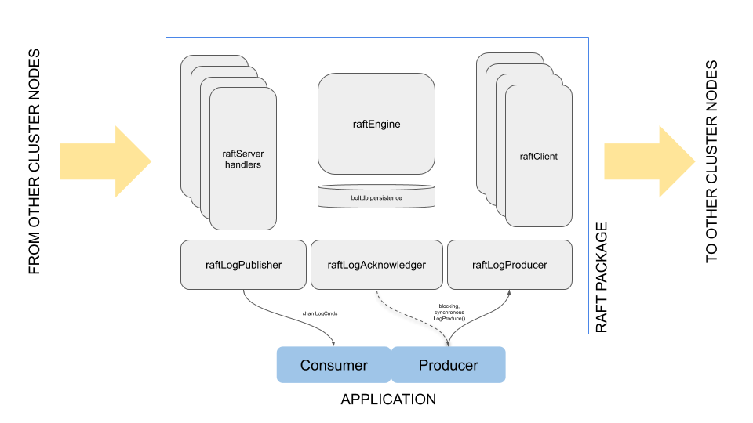

[](https://godoc.org/github.com/ccassar/raft)
[](https://travis-ci.org/ccassar/raft)
[](https://codecov.io/gh/ccassar/raft)
[](https://goreportcard.com/report/github.com/ccassar/raft)

# raft

Yet another implementation of raft, in go.

This raft package may be useful to any application run as a cluster of coordinating instances requiring a distributed
replicated log of events. An identical sequence of events will be exposed to each member instance. Each member instance
can contribute to that sequence. No third party system is required.

Member instances can use the replicated log to drive a deterministic state machine: the result would be that all
instances will arrive at the same state traversing the same sequence of states.

The best (and only) place to start if you are planning to use this package is [package documentation here](https://godoc.org/github.com/ccassar/raft).
Extensive examples are included, including how to setup TLS with mutual authentication to protect gRPC intra-cluster
communication. The rest of this README.md is largely about the implementation of the package itself.

The focus of this implementation is an all-batteries-included, production quality, extensively tested, complete
implementation.

Intra-cluster connectivity is implemented over gRPC with support for TLS protection with mutual authentication.

Observability is central to a production-quality implementation; structured logging (using Uber zap library)
and metrics export (using prometheus library and gRPC interceptors for both metrics and logging) are an integral
part of the implementation.

Unit test coverage is high and it is a goal to keep it so; unit test code itself is a key component of the
implementation.


### Raft, The Consensus Algorithm

Key references for the implementation are:

0. Diego Ongaro and John Ousterhout, [In Search of an Understandable Consensus Algorithm. 2014](https://www.usenix.org/conference/atc14/technical-sessions/presentation/ongaro) (ISUCA)

1. Diego Ongaro. Consensus: [Bridging Theory and Practice. Stanford University Ph.D. Dissertation. Aug. 2014.](https://ongardie.net/var/blurbs/pubs/dissertation.pdf) (CBTP)

2. Heidi Howard. [ARC: analysis of Raft consensus. University of Cambridge, Computer Laboratory, Jul. 2014.](https://www.cl.cam.ac.uk/techreports/UCAM-CL-TR-857.pdf) (ARC)

Reference to the above in code uses acronyms included above (i.e. CBTP, ARC, ISUCA).

For an excellent short presentation about Raft, see: https://www.usenix.org/node/184041

Key assertions:

- a raft node can be in one of three roles: Follower, Candidate and Leader.
- log entries only ever flow from leader to followers.
- a term will only ever have one leader.
- followers never accept log entries from leaders on smaller term.
- leaders never remove entries, and followers only remove entries which conflict with leader (and are by definition uncommitted).
- voters only vote for leader if leader is as up-to-date as voter at least.

Raft is not Byzantine fault tolerant. A Raft variant called [Tangaroa](http://www.scs.stanford.edu/14au-cs244b/labs/projects/copeland_zhong.pdf) proposes extensions
to make it so.

Core Raft provides clients with at-least-once guarantees (Section 6.3 CBTP). This is because a leader may
fail once a proposal has been committed but before an acknowledgment is sent to the client. The same section
proposes a method to support exactly-once guarantees for a proposal even in the context of concurrent writes
from the same session.


### Intracluster Messaging

Intracluster messaging in this package relies on gRPC. The gRPC server and client options can be configured by the
application. By default, the client and server are configured with aggressive maximum concurrent streams per transport,
and keepalive parameters and enforcement policy.

Both the server side and client side are set up with prometheus and zap logging interceptors in order to
provide consistent logging and metrics collection for gRPC calls. A `detailed` configuration option
[WithMetrics](https://godoc.org/github.com/ccassar/raft#WithLogger) under the control of the application determines 
whether we track the latency distribution of RPC calls.

#### TLS: Protecting Intracluster Messaging

The Raft package supports protecting intra-cluster traffic with mutually authenticated TLS. Client dial (`grpc.DialOptions`)
and server (`grpc.ServerOptions`) options can be provided by the application as part of `MakeNode()` initialisation.
Godoc provides [an example](https://godoc.org/github.com/ccassar/raft#example-MakeNode--WithTLSConfiguration) of how to
run with TLS enabled and with mutual authentication between server and client.

### Test Application

The source in [`app`](app/README.md) application is a simple skeleton demonstration showing simple features of the raft
package in action. Test Application instances running in a cluster will all see a single version of a distributed log
and each contribute random log commands to that log. Each command is made up of an originating node and a UUID.

Sample output from an instance in the application cluster would look like this:

```
Node0:29463c76-159a-43bd-8aa0-c0c654e67f69
Node0:832a806b-2cab-47d5-9a79-2a075f56324e
Node1:54caaacb-b585-4b01-8db4-9c3739d1c4ba
Node2:2740efcb-df3f-4c04-b3d0-b1c7ed163bc3
Node0:d6adc157-27c3-45de-9c91-f4d83ea2d19f
Node1:00bdafa3-30d4-4be8-bb06-3472927ad00a
Node0:3c732fc7-a31e-4a8d-8a01-c8199df058fd
```

A simple multistage Dockerfile [is provided](app/docker/Dockerfile), together with a helm chart to enable deployment of
the application cluster as a kubernetes deployment are provided. The Dockerfile pulls the source from github, builds the
test app executable in the first stage, and then builds an Ubuntu based image around the test application executable.


### Metrics

The Raft package accepts a prometheus metrics registry and uses that to track key statistics of the Raft
operation, including RPC metrics client and server side (using gRPC middleware interceptors). The WithMetrics can be
called without a registry in which case metrics are collected against the default registry. If WithMetrics option is
not setup, no metrics are collected.

 A Grafana dashboards is provided for the raft package. The kubernetes/helm based deployment of the example application
 provides a live view of the Grafana raft dashboard.


### Logging

Logging is primarily to three levels; Info which logs very minimally and captures very significant events like
role (leader/follower/candidate) changes, Debug which is far more verbose, and Error.

Logs are named `raft.NODE<node index>`. GRPC server and client message logs are named `raft.NODE<node index>.GRPC_<C|S>`
so they can be easily filtered in or out. GRPC message logs are logged at debug level only. Log names are appended to
whatever name the the application uses if it provides the log through `WithLogger` option.

By default, the raft package will set up a customised production zap log: logging Info level and above,
structured and JSON formatted, with sampling and caller disabled, and stacktrace enabled for errors, and logging
to stdout. The logger field is set (using logger.Named()) to unambiguously indicate that logs are coming from raft
package. Logs, by default, look like this:

```
{"level":"info","ts":"2019-07-07T10:20:23.859+0100","logger":"raft.NODE0","msg":"raft package, hello (logging can be customised or disabled using WithLogger options)"}
{"level":"info","ts":"2019-07-07T10:20:23.866+0100","logger":"raft.NODE0","msg":"raftEngine, start running","currentTerm":0,"commitIndex":0,"appliedIndex":0,"state":"not set","VotedFor":0,"currentLeader":-1}
{"level":"info","ts":"2019-07-07T10:20:23.866+0100","logger":"raft.NODE0","msg":"ROLE CHANGE: from UNINIT to FOLLOWER","currentTerm":0,"commitIndex":0,"appliedIndex":0,"state":"follower","VotedFor":0,"currentLeader":-1}
{"level":"info","ts":"2019-07-07T10:20:35.814+0100","logger":"raft.NODE0","msg":"ROLE CHANGE: from FOLLOWER to CANDIDATE","currentTerm":0,"commitIndex":0,"appliedIndex":0,"state":"candidate","VotedFor":0,"currentLeader":-1}
{"level":"info","ts":"2019-07-07T10:20:35.818+0100","logger":"raft.NODE0","msg":"ROLE CHANGE: from CANDIDATE to LEADER","currentTerm":1,"commitIndex":0,"appliedIndex":0,"state":"leader","VotedFor":0,"currentLeader":0}
```

If the log encoding is set to `console` instead of `JSON` (unusual in production environments, but useful if looking
at logs directly instead of through some log aggregating tool like Splunk or Elastic), then `Info` level logs look like
this:

```
2019-07-07T16:05:33.104+0100	info	raft.NODE0	raft package, hello (logging can be customised or disabled using WithLogger options)
2019-07-07T16:05:33.115+0100	info	raft.NODE0	raftEngine, start running	{"currentTerm": 0, "commitIndex": 0, "appliedIndex": 0, "state": "uninit", "VotedFor": 0, "currentLeader": -1}
2019-07-07T16:05:33.115+0100	info	raft.NODE0	ROLE CHANGE: from UNINIT to FOLLOWER	{"currentTerm": 0, "commitIndex": 0, "appliedIndex": 0, "state": "follower", "VotedFor": 0, "currentLeader": -1}
2019-07-07T16:05:45.064+0100	info	raft.NODE0	ROLE CHANGE: from FOLLOWER to CANDIDATE	{"currentTerm": 0, "commitIndex": 0, "appliedIndex": 0, "state": "candidate", "VotedFor": 0, "currentLeader": -1}
2019-07-07T16:05:45.070+0100	info	raft.NODE0	ROLE CHANGE: from CANDIDATE to LEADER	{"currentTerm": 1, "commitIndex": 0, "appliedIndex": 0, "state": "leader", "VotedFor": 0, "currentLeader": 0}
2019-07-07T16:05:45.187+0100	info	raft.NODE0	application is requesting a shutdown
2019-07-07T16:05:45.187+0100	info	raft.NODE0	raftEngine, stop running	{"currentTerm": 1, "commitIndex": 0, "appliedIndex": 0, "state": "leader", "VotedFor": 0, "currentLeader": 0}
2019-07-07T16:05:45.187+0100	info	raft.NODE0	raft package, goodbye
```

Raft logging is customisable in the MakeNode call, application controls logger through the WithLogging option.
See godoc [example for details](https://godoc.org/github.com/ccassar/raft#example-MakeNode--WithCustomisedLogLevel). WithLogger option allows app to disable logging, provide its
own zap logger, or, in conjunction with DefaultZapLoggerConfig, to start with the default logging configuration
in raft package, modify it based on application need, and activate it. 

### Error Handling

Errors returned from the raft package across APIs attempt to provide the necessary context to
clarify the circumstances leading to the error (in the usual form of a string returned via Error()
method on error). The same error can also be squeezed for a root cause using the errors.Cause()
method to support programmatic handling of the error if required. If the root cause is internal to raft,
then the sentinel error will be one of those defined [here](raft_errors.go) and can be tested
programmatically. If the root cause originated in some package downstream of raft, then the downstream
error is propagated explicitly. Godoc documentation includes an
[example](https://godoc.org/github.com/ccassar/raft#example-MakeNode) of how the errors can be handled 
programmatically. In essence:

```
	n, err := MakeNode(ctx, &wg, cfg, localNodeIndex, WithLogger(mylog))
	if err != nil {

		switch errors.Cause(err) {
		case RaftErrorBadMakeNodeOption:
			//
			// Handle specific sentinel in whichever way we see fit.
			// ...
		default:
			// Root cause is not a handled sentinel.
		}
		// err itself renders the full context not just the sentinel.
		fmt.Println(err)
	}

```


### Report Card

Lots to go, but do come inside and have a look.

Completed so far:

 - General package infra: gRPC client and server setup, logging, metrics, UT
 - Leadership election
 - Log replication
 - basic metrics export

Todo next:

 - election: performance and negative testing; more functional testing around recovery
 - graceful handover on leader before shutdown
 - refactor TestLogReplication()
 - errors/utilisation/saturation metrics
 - deploy with helm chart and prometheus grafana dashboard on gke, and docker compose based example for those running
   locally.

Target is to, eventually, cover all of Raft including cluster membership extensions, log compaction, exactly-once
guarantees to clients and, beyond Raft, to bring Byzantine fault tolerance via Tangaroa.


### Dependencies

Other than the usual dependencies (i.e. go installation), protoc needs to be installed as [described here](https://github.com/golang/protobuf) 
and the directory hosting protoc should be in the PATH. Running `go generate` will automatically regenerate 
generated source.


### Implementation Notes

The figure below represents the main components in the raft package and the interactions with the application.



ASIDE; the choice of term 'client' can lead to confusion - almost invariably client is
referring to the gRPC client functionality which a Node uses to interact with other nodes'
servers in the cluster. The term 'application' is used to refer to the entity reading and consuming
log updates. In the raft specifications, 'application' is called client.
 
From raftEngine to gRPC client goroutines, we never block - if channel if full raftEngine side proceeds.
Client side recovers by pulling when channel starts to drain. This constraint should always be satisfied
because this is what ensures that we never livelock with client goroutine pushing to raftEngine, and raftEngine
trying to push to raftEngine. 

#### Notes about Flows

The life-of-a-packet for various paths through the system...

##### Application learns about newly committed log command from raft package:

Trigger: load a new commitIndex. This could happen when we learn of new commit index as followers from a leader,
or as a leader when an acknowledgement for an AppendEntry update is received.
Action: the local publisher is notified (assuming a notification is not pending already). The local publisher
strives to keep the local application in sync with committed log commands.

##### Application pushes new log command on follower node:

Trigger: application pushes log command to log producer via LogProduce(). Log producer hands off logCommandContainer
to raftEngine and blocks waiting for response on response channel. This means we will only have one cmd log in flight
at any one point if the client serialises calls to LogProduce. (Eventually we may publish results asynchronously to
improve performance.) 
Action: raftEngine hands the logCommandContainer to the client for the leader on the logCommand channel as a
logCmdEvent . The log command is propagated to the leader over gRPC and handled there. The entries are added to the
log. And ack tracker is setup to watch for when the committedIndex moves to this index. When that happens the tracker
will acknowledge which will release the response to the remote node. When the result is received at the originating
node for the producing application, it is passed back to the log producer and the application through the return
channel in the logCommandContainer. In the case where the log command was sourced locally to the leader, then the
acker will feed the acknowledgement directly to the logProducer and the application.

##### raftEngine receives a new log command on leader node:

Trigger: remote (or local) logCommand message with new log command.
Action: raftEngine installs the new log command in the log, and notifies clients (if no notification is pending)
one by one. Clients will pull and doggedly attempt to get the missing log commands to the remote nodes. raftEngine
leader tracks client matchIndex and nextIndex. Any rejections received for AppendEntry messages reset the next
index. When a node becomes a leader it assumes that followers are in sync by setting the nextIndex to one ahead of
index of last entry in log on leader. The keepalive includes the latest prevLogIndex and prevLogTerm. Followers
which are not in sync, will nak the keepalive resulting in their nextIndex being rolled back to hunt for common
point in log between leader and follower.
    
         
#### Unrecoverable Errors

When the raft packages encounters failures which are unrecoverable; e.g. persisted content it can not unmarshal, or
persistent store failure, raft package signals catastrophic failure to the application. The expectation is that the
application does what is necessary and appropriate to draw operator attention (e.g. shutdown).


#### Concurrency and Synchronisation

The package uses multiple goroutines;
 - a group of go routines offload communication to other cluster nodes (local node acting as a gRPC client to each
 of the other nodes in the cluster). A goroutine fed through a buffered channel receives messages which need to be
 communicated to the remote node. The goroutine handles the call and blocks waiting for response, and on receipt,
 delivers the response back to the raft engine thread.
 - grpc servers handling RPCs initiated by remote nodes in the cluster
 - the central goroutine handles the raft state machine. Messages received from other goroutines and timer events are
   the main inputs to the state machine. This goroutine never blocks on other go routines. This way we make reasoning
   about concurrency in raft package a little less painful, and ensure we avoid deadlocks.
 - while in leader state, an independent go routine handles acknowledging log command requests from local or remote
   applications when the log command is committed.
 - an application facing goroutine is responsible for feeding the channel of 'applied' log entries to the application.
  
Synchronisation is mostly lock free and largely message passing based. Other synchronisation primitives used include
atomic updates and mutexes held briefly in leaf functions.